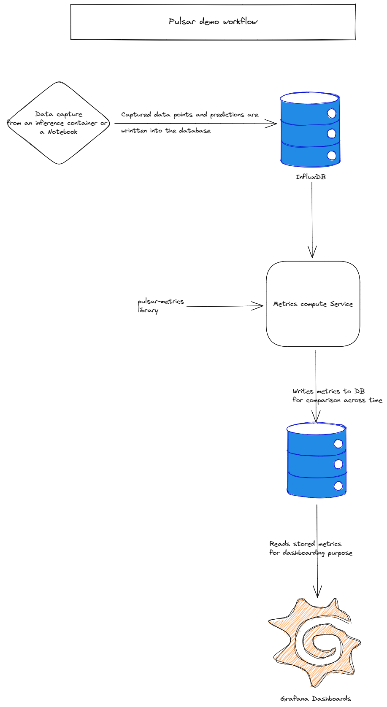

# Pulsar Local demo

Thsi repo containing an example use-case showing how to leverage [pulsar-data-collection](https://github.com/Rocket-Science-Development/pulsar_data_collection) and [pulsar-metrics](https://github.com/Rocket-Science-Development/pulsar_metrics) to implement model monitoring and performance management

## Quickstart

1. install docker and docker-compose
2. execute the following commands :

    ```bash
        export DB_USER=admin DB_PASSWORD=pass123 GRAFANA_USERNAME=admin GRAFANA_PASSWORD=pass123
        docker-compose up --build
    ```

3. open a browser tab on `localhost:3000` and enter the grafana credentials set at the previous step

## Demo Components



here is a description of the steps inside the workflow :

1. Data is captured from an inference container or a notebook using [pulsar-data-collection](https://github.com/Rocket-Science-Development/pulsar_data_collection)
2. Collected data point, predictions, and other relevant configured metadata are written into an index inside influxdb
3. `compute-metrics` service will query the latest entries from the database then leverage [pulsar-metrics](https://github.com/Rocket-Science-Development/pulsar_metrics) in order to compute the different metrics.
4. All computed metrics will then be written to another index in influxdb in order to be displayed on grafana.

## About [PulsarML](https://pulsar.ml/)

PulsarML is a project helping with monitoring your models and gain powerful insights into its performance.

We released two Open Source packages :

- [pulsar-data-collection](https://github.com/Rocket-Science-Development/pulsar_data_collection) :  lightweight python SDK enabling data collection of features, predictions and metadata from an ML model serving code/micro-service
- [pulsar-metrics](https://github.com/Rocket-Science-Development/pulsar_metrics) : library for evaluating and monitoring data and concept drift with an extensive set of metrics. It also offers the possibility to use custom metrics defined by the user.

We also created [pulsar demo](https://github.com/Rocket-Science-Development/pulsar_demo) to display an example use-case showing how to leverage both packages to implement model monitoring and performance management.

Want to interact with the community? join our [slack channel](https://pulsarml.slack.com)

Powered by [Rocket Science Development](https://rocketscience.one/)

## Contributing

1. Fork this repository, develop, and test your changes
2. open an issue
3. Submit a pull request with a reference to the issue
