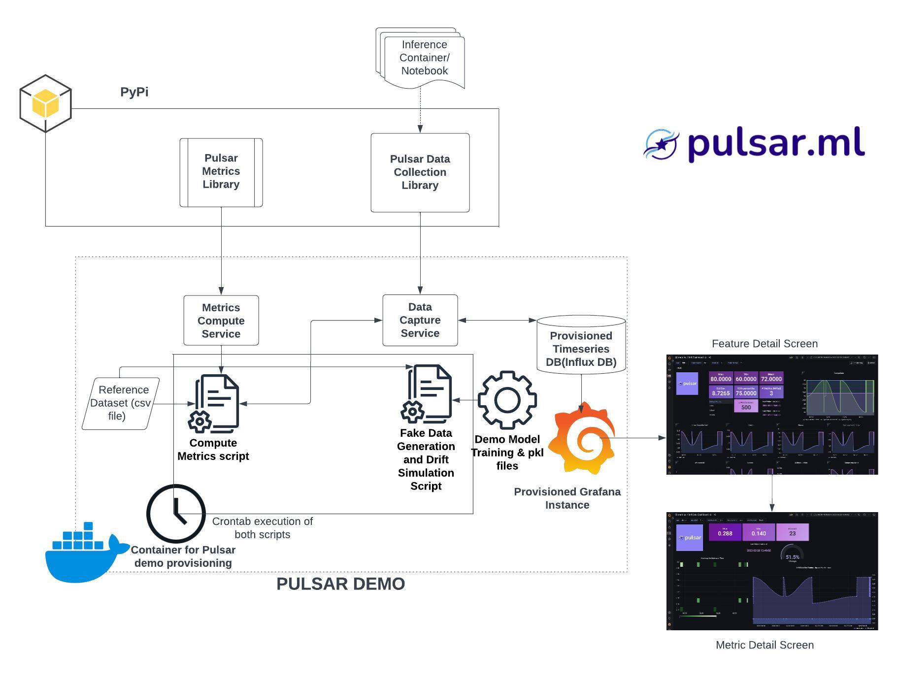

# Pulsar.ML Local demo

This repository contains an example use-case demonstrating how to utilize [pulsar-data-collection](https://github.com/Rocket-Science-Development/pulsar_data_collection) and [pulsar-metrics](https://github.com/Rocket-Science-Development/pulsar_metrics) to implement model monitoring and performance management.

## Quickstart

1. Make sure you have Docker and Docker Compose installed.
2. Execute the following commands:

    ```bash
        export GRAFANA_USERNAME=admin;
        export GRAFANA_PASSWORD=pass123;
        export DB_USER=admin;
        export DB_PASSWORD=pass123;
        docker-compose up --build
    ```

3. Open a web browser and go to localhost:3000. Enter the Grafana credentials set in the previous step.

## Pulsar.ML Architecture



## Demo Components


Here is a description of the steps within the workflow

1. Data is captured from an inference container or a notebook using [pulsar-data-collection](https://github.com/Rocket-Science-Development/pulsar_data_collection)
2. Collected data point, predictions, and other relevant configured metadata are written into an index inside influxdb
3. `compute-metrics` service will query the latest entries from the database then leverage [pulsar-metrics](https://github.com/Rocket-Science-Development/pulsar_metrics) in order to compute the different metrics.
4. All computed metrics are then written to another index in InfluxDB for display in Grafana.

## About [Pulsar.ML](https://pulsar.ml/)

Pulsar.ML is an application designed to assist with monitoring your machine learning models and gaining powerful insights into their performance.

We have released two open-source packages:

- [pulsar-data-collection](https://github.com/Rocket-Science-Development/pulsar_data_collection) :  A lightweight Python SDK for collecting features, predictions, and metadata from an ML model serving code or microservice.
- [pulsar-metrics](https://github.com/Rocket-Science-Development/pulsar_metrics) : A library for evaluating and monitoring data and concept drift with an extensive set of metrics. It also provides the flexibility to use custom metrics defined by the user.

We also created [pulsar demo](https://github.com/Rocket-Science-Development/pulsar_demo) to showcase an example use-case that demonstrates how to leverage both packages for model monitoring and performance management.

Want to interact with the community? join our [slack channel](https://pulsarml.slack.com)

Powered by [Rocket Science Development](https://rocketscience.one/)

## Contributing

1. Fork this repository, develop, and test your changes
2. open an issue
3. Submit a pull request with a reference to the issue
